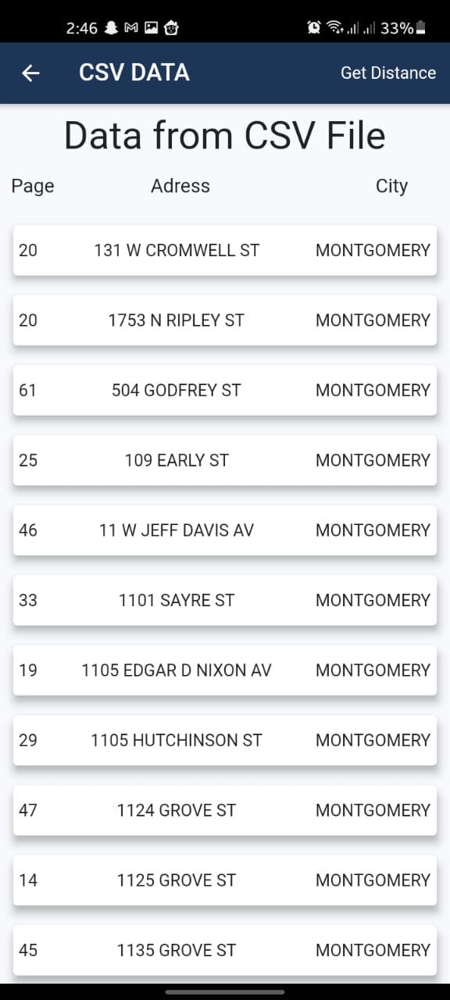
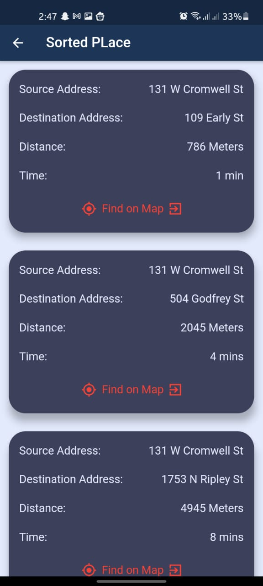

# locationsort

A flutter based app which read Location list from CSV file and display data of CSV file to sort location based on distance.?

I am using Google Map API Distance API function to get distance between two places.

After sorting is done User can see the list of nearest place in New Screen .

Here are some of the Screenshot of my APP.

#### HomeScreen Display

#### CSV Data Loaded Screen

#### Sorted Place

Note: You can find the destination place in google Map by clicking on Find on Map button and Google Map will be opened.

TO use this APP You need APi Key from GOOGLE MAP CONSOLE [Link to API Key](https://developers.google.com/maps/documentation/embed/get-api-key)

I have uploaded Csv File for testing purpose. And link to csv file is [here](./testCSVFile.xlsx) 

You can write API Key in Line 29 [LoadCSVDataScreen](./lib/loadCsvDataScreen.dart) file

For testing and Demo purpose you can donwload this [APK file](./build/app/outputs/apk/release/app-release.apk) and let me know about it 

If you still face any problem let me know and i will help you.

Thanks for Visiting here
